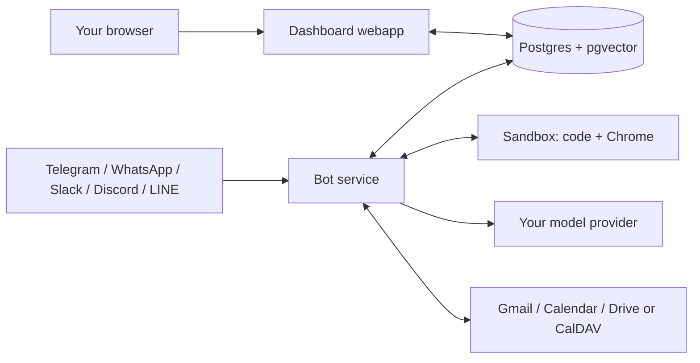

# ClosedHand

A personal AI assistant you actually own. It lives in your messaging apps, reads the email and calendar you already have, remembers what matters, and keeps working while you sleep, all from a box you control with keys you hold.

> **Demo coming.** A 30-second ask-your-inbox GIF will sit here once the maintainer's own instance is running the shipped build.
<!-- DEMO GIF PLACEHOLDER: 30s of "ask your inbox anything", recorded on a live instance. -->

## Why this exists

Most AI assistants are a tab you visit, rented from a company that holds your data. ClosedHand flips both parts. It comes to where you already talk (Telegram in three taps, with Discord, Slack, LINE and WhatsApp available too), and everything about it is yours: the server, the database, the model keys, the memory. There is no hosted relay, no telemetry, and no account with anyone except the providers you choose to bring.

It is strictly single-tenant. One install serves one person, and the first account to message your bot becomes its owner. Everyone else is politely refused.

## Quickstart

One line:

```sh
curl -fsSL https://raw.githubusercontent.com/notnotjim/ClosedHand/main/install.sh | sh
```

Or, if piping strangers' scripts into your shell is exactly what you self-host to avoid, download it, read it (it is short), then run it:

```sh
curl -fsSL https://raw.githubusercontent.com/notnotjim/ClosedHand/main/install.sh -o install.sh
less install.sh
sh install.sh
```

Either way it checks for Docker, clones the repo, writes a `.env` with generated secrets, downloads pre-built images (nothing compiles on your machine), and starts the stack. The same steps by hand:

```sh
git clone https://github.com/notnotjim/ClosedHand.git closedhand
cd closedhand
cp .env.example .env
docker compose up -d
```

Hacking on ClosedHand itself? Build from source with `docker compose -f docker-compose.yml -f docker-compose.build.yml up -d --build` (or `CLOSEDHAND_BUILD=1 sh install.sh`).

The installer opens the setup wizard in your browser when the stack is up (or tells you the address, **http://localhost:3000**, if it cannot). The wizard walks you through the rest and lights each step up as it detects you have done it: paste one model provider key, set an admin password, connect Telegram with a token from BotFather, then connect Google through a guided wizard that opens the exact console pages you need. You make your own Google key there, because there is no company in the middle to hold one for you. First conversation is usually under ten minutes in, and Google adds about ten more.

Bring whichever model provider you prefer. A single DeepInfra key is the golden path because one key covers chat plus the embedding model, but OpenAI, Anthropic, Gemini, Groq, xAI and any OpenAI-compatible endpoint (including a local Ollama) are all first-class.

## What you get

**Chat that can act.** Ask questions, but also send mail, create events, set reminders, track flights, and run multi-step background agents that report back when they finish.

**Context Brain.** ClosedHand continuously indexes your mail, calendar and files into a knowledge base that recalls by meaning, not just keywords. Ask "what did the accountant say about the deadline" and it finds the thread even though you never said "email"; ask for an invoice number and it matches the number itself.

**A real computer.** An isolated sandbox container gives it code execution and its own Chrome, with a persistent workspace and browser profile. Watch it work live at `localhost:6080`.

**Chat apps, honestly ranked.** Telegram is the easy one: a token from BotFather, no public address needed, works behind your router on a laptop. Discord is nearly as simple. WhatsApp is possible but heavy: Meta requires a Business account, a dedicated number and a public HTTPS address, so it belongs on an always-on server rather than a laptop.

**Calendar without Google, if you prefer.** A generic CalDAV client covers iCloud, Fastmail, Nextcloud and friends with an app-specific password, no OAuth consent screens involved.

**A dashboard that tells the truth.** Connections, agents, memory, and a usage tab that shows where your key money goes, token by token, feature by feature, from your providers' own numbers.

## How it compares

Honest version, because you will find out anyway:

| | ClosedHand | Khoj | Onyx (Danswer) | Memory layers (Mem0, Zep, ...) |
|---|---|---|---|---|
| Shape | Personal assistant in your chat apps | Personal search/chat over your notes and docs | Team RAG over workplace apps | Developer libraries, not assistants |
| Acts on your behalf (send, schedule, browse, run agents) | Yes | Limited | No, retrieval-focused | No |
| Continuous email/calendar sync | Yes | No (notes, docs, web) | Yes (team connectors) | No |
| Multi-user | No, deliberately one owner | Yes | Yes | N/A |
| Runs fully on your keys and your box | Yes | Yes (self-host) | Yes (self-host) | Yes |

If you want team knowledge search, use Onyx. If you want your notes chatted with, Khoj is lovely. ClosedHand is for one person who wants an assistant with hands.

What it is not: multi-user, a hosted service, or mature. It is a young project with one maintainer, support happens in GitHub issues with no SLA, and WhatsApp requires your own Meta business app and a public URL, which is genuinely tedious and documented as such.

## Architecture



Two Node services (bot and dashboard) that share a Postgres with pgvector and never import each other's code, plus the sandbox container. `docker compose up` starts all four and applies the schema on first boot. The same codebase runs against Supabase for a managed-Postgres deployment; a driver layer keeps both paths honest.

## Requirements

Docker with the compose plugin, and at least one model provider key. Works on amd64 and arm64, including Apple Silicon and ARM VPSes.

Memory depends on your provider. With a full-service key (DeepInfra, OpenAI, Gemini), 2 GB of RAM runs everything and no local models are ever downloaded. With a chat-only provider (xAI, Anthropic, Groq), ClosedHand fetches a compact local embedding model (~300 MB, once, with progress shown) so memory works anyway; plan for 4 GB in that case. On a tight box you can drop the sandbox service and stay closer to 2 GB.

Where you run it sets the tier. On a laptop it works while the lid is open and catches up when you return. On an always-on box (an old mini PC, a small VPS) the background sync, scheduled agents and proactive messages run around the clock, which is the full product.

## Security posture

Single-tenant by construction, not by configuration: every request resolves to the one admin. The first platform sender claims the instance and strangers get one polite refusal; `ALLOWED_*` env lists can extend or restrict that. You choose the dashboard password in the setup wizard, and it locks every page but the wizard itself; `ADMIN_PASSWORD` in `.env` overrides it for scripted installs. OAuth tokens are encrypted at rest when `TOKEN_ENCRYPTION_KEY` is set. Your data never transits anyone's infrastructure except the providers you connected.

## Contributing

Issues and PRs welcome. Open an issue before starting anything sizeable so the approach can be agreed first. A genuinely useful first contribution: run `install.sh` on a clean Linux box or WSL and report what breaks.

## License

[MIT](LICENSE).
